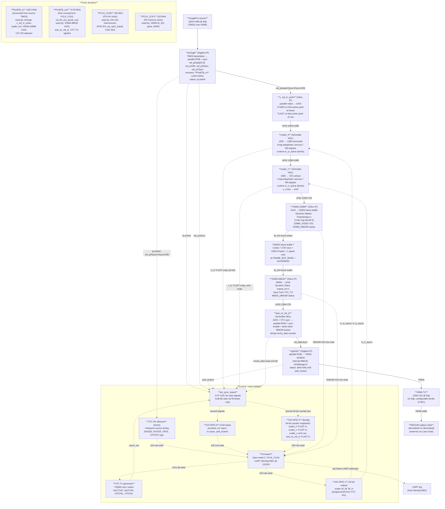

# Phase B/D HDMI pipeline — stages, clocks, and observability

Vertical data flow from source HDMI input to monitor output, with clock domains
and the counters / status registers firmware can read at each stage.

## Expected counter values per source frame (1920×1080 @ 60p)

| Counter | Where | Expected | Meaning if off |
|---|---|---|---|
| `h_in` | scaler_h s_axis_tlast | **1080** | If >1080: v_vid_in_axi4s emits extras during V-blank |
| `v_in` | scaler_v s_axis_tlast | **1080** | Should match h_in; if off, scaler_h drops/adds TLAST |
| `v_emit` | scaler_v v_cross events | **720** | If ≠720, scaler math wrong for given IN_H |
| `mm2s_tlast` | axis_to_vid_io s_axis_tlast | **720** (per OUTPUT frame) | If <720, MM2S starved; if >720, MM2S delivered extras (would imply VTC active too long) |
| `S2MM_DMASR` | VDMA reg 0x34 | bits 4/5/6/8/9/11/12 = 0 (no errors) | Framing errors |
| `MM2S_DMASR` | VDMA reg 0x04 | same | Framing errors |

## Confirmed so far (iter4g first read)

- ✅ `h_in = 1080` — v_vid_in_axi4s correct
- ✅ `v_in = 1080` — scaler_h propagates TLAST 1:1 correctly
- ✅ `v_emit = 720` — scaler_v emits exactly 720 v_cross per source frame
- ❓ `mm2s_tlast` — WIP (adding now in iter4g extension)
- ❓ S2MM/MM2S DMASR — firmware reads pending

## Known artifact

Bottom ~15-27 rows of every output frame show top-of-frame bars instead of
expected PLUGE-bottom content. Bug is downstream of scaler (confirmed via
counters above). Adding more counters to localize between S2MM, MM2S, and
axis_to_vid_io.

## Source notes for next session

- WIP branch: `iter4g-counter-infra` (built on iter4e at commit 0e6d672)
- iter4f-wip-pattern-diag branch: row-index test pattern (still useful diagnostic to flip back to)
- Once root cause is found and fixed, strip diagnostic-only HDL (test pattern,
  counters can stay as permanent debug surface) and merge to main as iter4f.
