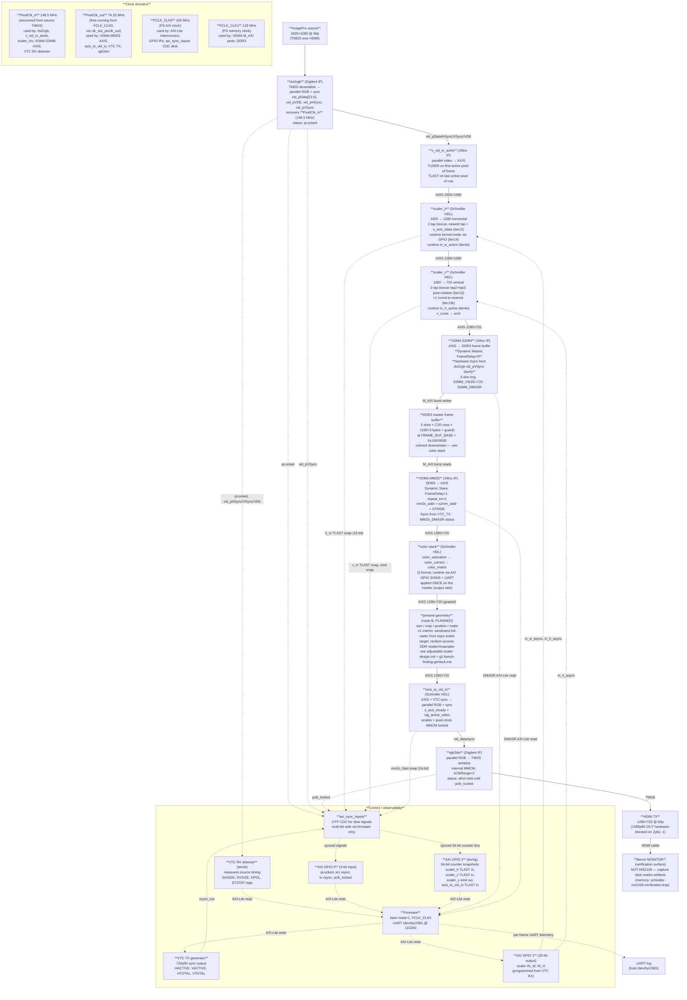

# Phase B/D HDMI pipeline — stages, clocks, and observability

Vertical data flow from source HDMI input to monitor output, with clock domains
and the counters / status registers firmware can read at each stage.

**Updated 2026-06-01** to current `iter5-1080p-clean` reality: 2-tap boxcar scaler
(iter12/13), iter6 hardware S2MM fsync, 5-slot ring, output color stack, 720p60,
runtime kernel-mode (iter14), and the **present-geometry insertion point** for the
adjustable scaler (route B). The iter4g bottom-bars artifact is resolved (iter6).

```mermaid
flowchart TD
    SRC["**ImagePro source**<br/>1920×1080 @ 60p<br/>(TMDS over HDMI)"]
    DVI["**dvi2rgb** (Digilent IP)<br/>TMDS deserialize → parallel RGB + sync<br/>vid_pData[23:0], vid_pVDE, vid_pHSync, vid_pVSync<br/>recovers **PixelClk_in** (148.5 MHz)<br/>status: pLocked"]
    VIA["**v_vid_in_axi4s** (Xilinx IP)<br/>parallel video → AXIS<br/>TUSER on first active pixel of frame<br/>TLAST on last active pixel of row"]
    SCH["**scaler_h** (Schindler HDL)<br/>1920 → 1280 horizontal<br/>2-tap boxcar, newest tap = s_axis_tdata (iter12)<br/>runtime kernel-mode via GPIO (iter14)<br/>runtime in_w_active (iter4e)"]
    SCV["**scaler_v** (Schindler HDL)<br/>1080 → 720 vertical<br/>2-tap boxcar tap2+tap3 post-rotation (iter13)<br/>+1 round-to-nearest (iter13b)<br/>runtime in_h_active (iter4e)<br/>v_cross → emit"]
    S2MM["**VDMA S2MM** (Xilinx IP)<br/>AXIS → DDR3 frame buffer<br/>**Dynamic Master, FrameDelay=0**<br/>**hardware fsync from dvi2rgb vid_pVSync (iter6)**<br/>5-slot ring · S2MM_VSIZE=720 · S2MM_DMASR"]
    DDR["**DDR3 master frame buffer**<br/>5 slots × (720 rows × 1280×3 bytes + guard)<br/>at FRAME_BUF_BASE = 0x10000000<br/>colored downstream — see color stack"]
    MM2S["**VDMA MM2S** (Xilinx IP)<br/>DDR3 → AXIS<br/>Dynamic Slave, FrameDelay=1, repeat_en=1<br/>mm2s_addr = s2mm_addr + STRIDE<br/>fsync from VTC_TX · MM2S_DMASR status"]
    COLOR["**color stack** (Schindler HDL)<br/>color_saturation → color_correct → color_matrix<br/>Q-format, runtime via AXI GPIO 3/4/5/6 + UART<br/>applied ONCE on the master (output side)"]
    PG["**present-geometry** (route B, PLANNED)<br/>size / crop / position / matte<br/>v1 interim: windowed full-raster from input scaler<br/>target: random-access DDR reader/resampler<br/>see adjustable-scaler-design.md + g1-bench-finding-genlock.md"]
    A2V["**axis_to_vid_io** (Schindler HDL)<br/>AXIS + VTC sync → parallel RGB + sync<br/>s_axis_tready = vtg_active_video<br/>enable = pixel-clock MMCM locked"]
    R2D["**rgb2dvi** (Digilent IP)<br/>parallel RGB → TMDS serialize<br/>internal MMCM, kClkRange=2<br/>status: aRst held until pclk_locked"]
    TX["**HDMI TX**<br/>1280×720 @ 60p<br/>(1080p60 OUT hardware-blocked on Zybo -1)"]
    MON["**Bench MONITOR** (verification surface)<br/>NOT MS2109 — capture stick masks artifacts<br/>(memory: schindler-ms2109-verification-trap)"]

    SRC --> DVI
    DVI -->|"vid_pData/HSync/VSync/VDE"| VIA
    VIA -->|"AXIS 1920×1080"| SCH
    SCH -->|"AXIS 1280×1080"| SCV
    SCV -->|"AXIS 1280×720"| S2MM
    S2MM -->|"M_AXI burst writes"| DDR
    DDR -->|"M_AXI burst reads"| MM2S
    MM2S -->|"AXIS 1280×720"| COLOR
    COLOR -->|"AXIS 1280×720 (graded)"| PG
    PG -->|"AXIS 1280×720"| A2V
    A2V -->|"vid_data/sync"| R2D
    R2D -->|"TMDS"| TX
    TX -->|"HDMI cable"| MON

    subgraph CLKS["**Clock domains**"]
        direction TB
        CLK1["**PixelClk_in** 148.5 MHz<br/>(recovered from source TMDS)<br/>used by: dvi2rgb, v_vid_in_axi4s,<br/>scaler_h/v, VDMA S2MM AXIS,<br/>VTC RX detector"]
        CLK2["**PixelClk_out** 74.25 MHz<br/>(free-running from FCLK_CLK0,<br/>via clk_wiz_pixclk_out)<br/>used by: VDMA MM2S AXIS,<br/>axis_to_vid_io, VTC TX, rgb2dvi"]
        CLK3["**FCLK_CLK0** 100 MHz<br/>(PS AXI clock)<br/>used by: AXI-Lite interconnect,<br/>GPIO IPs, axi_sync_inputs CDC dest"]
        CLK4["**FCLK_CLK1** 133 MHz<br/>(PS memory clock)<br/>used by: VDMA M_AXI ports, DDR3"]
    end

    subgraph CTRL["**Control / observability**"]
        direction TB
        FW["**Firmware**<br/>bare-metal C, FCLK_CLK0<br/>UART /dev/ttyUSB1 @ 115200"]
        VTC_RX["**VTC RX detector** (iter4e)<br/>measures source timing<br/>DASIZE, DVSIZE, DPOL, DTSTAT regs"]
        VTC_TX["**VTC TX generator**<br/>720p50 sync output<br/>HACTIVE, VACTIVE, HTOTAL, VTOTAL"]
        GPIO0["**AXI GPIO 0** (4-bit input)<br/>pLocked, src vsync,<br/>tx vsync, pclk_locked"]
        GPIO1["**AXI GPIO 1** (32-bit output)<br/>scaler IN_W, IN_H<br/>(programmed from VTC RX)"]
        GPIO2["**AXI GPIO 2** (iter4g)<br/>64-bit counter snapshots:<br/>scaler_h TLAST in,<br/>scaler_v TLAST in,<br/>scaler_v emit out,<br/>axis_to_vid_io TLAST in"]
        SYNC["**axi_sync_inputs**<br/>2-FF CDC for slow signals<br/>multi-bit safe via firmware retry"]
    end

    DVI -. "pLocked, vid_pHSync/VSync/VDE" .-> VTC_RX
    VTC_RX -. "AXI-Lite read" .-> FW
    FW -. "AXI-Lite write" .-> GPIO1
    GPIO1 -. "in_w_async, in_h_async" .-> SCH
    GPIO1 -. "in_h_async" .-> SCV

    DVI -. "pLocked" .-> SYNC
    DVI -. "vid_pVSync" .-> SYNC
    R2D -. "pclk_locked" .-> SYNC
    VTC_TX -. "vsync_out" .-> SYNC

    SCH -. "h_in TLAST snap (16-bit)" .-> SYNC
    SCV -. "v_in TLAST snap, emit snap" .-> SYNC
    A2V -. "mm2s_tlast snap (16-bit)" .-> SYNC

    SYNC -. "synced signals" .-> GPIO0
    SYNC -. "synced 64-bit counter bus" .-> GPIO2

    GPIO0 -. "AXI-Lite read" .-> FW
    GPIO2 -. "AXI-Lite read" .-> FW
    S2MM -. "DMASR AXI-Lite read" .-> FW
    MM2S -. "DMASR AXI-Lite read" .-> FW
    FW -. "AXI-Lite write" .-> VTC_TX

    FW -.->|"per-frame UART telemetry"| OUT["UART log<br/>(host /dev/ttyUSB1)"]
```

## Expected counter values per source frame (1920×1080 @ 60p)

| Counter | Where | Expected | Meaning if off |
|---|---|---|---|
| `h_in` | scaler_h s_axis_tlast | **1080** | If >1080: v_vid_in_axi4s emits extras during V-blank |
| `v_in` | scaler_v s_axis_tlast | **1080** | Should match h_in; if off, scaler_h drops/adds TLAST |
| `v_emit` | scaler_v v_cross events | **720** | If ≠720, scaler math wrong for given IN_H |
| `mm2s_tlast` | axis_to_vid_io s_axis_tlast | **720** (per OUTPUT frame) | If <720, MM2S starved; if >720, MM2S delivered extras (would imply VTC active too long) |
| `S2MM_DMASR` | VDMA reg 0x34 | bits 4/5/6/8/9/11/12 = 0 (no errors) | Framing errors |
| `MM2S_DMASR` | VDMA reg 0x04 | same | Framing errors |

## Status (current — iter5-1080p-clean)

- ✅ `h_in = 1080`, `v_in = 1080`, `v_emit = 720` — scaler counters correct (iter4g read).
- ✅ Bottom-bars artifact **RESOLVED** by iter6 hardware S2MM fsync (see
  `iter6-s2mm-fsync-fix.md`); the old "bottom ~15-27 rows show top-of-frame bars" no
  longer reproduces. The iter4h VSIZE-overallocate "fix" was wrong and reverted
  (memory: `schindler-iter5-bisect-findings`).
- ✅ Output color stack (saturation → correct → matrix) live and runtime-tunable over
  UART (memory: `schindler-color-pipeline`).
- ✅ 60→24 / 60→60 FRC clean on the 5-slot ring via Dynamic Genlock (memory:
  `schindler-iter5-1080p-clean` production substrate).
- 🚧 **present-geometry (adjustable scaler)** — the `PG` block above is the planned
  insertion. Route B chosen 2026-06-01; the input-side firmware-reframe attempt was
  reverted because it breaks genlock (`g1-bench-finding-genlock.md`). v1 path under
  decision: A (windowed full-raster from input scaler) vs a random-access DDR
  reader/resampler.

## Provenance

- Production substrate + live build status: [`build-manifest.md`](build-manifest.md) (canonical).
- Architecture/order-of-operations: [`adjustable-scaler-design.md`](adjustable-scaler-design.md),
  [`signal-flow.md`](signal-flow.md) §0.
- **Verify on the bench MONITOR, never the MS2109 capture stick** (memory:
  `schindler-ms2109-verification-trap`).
