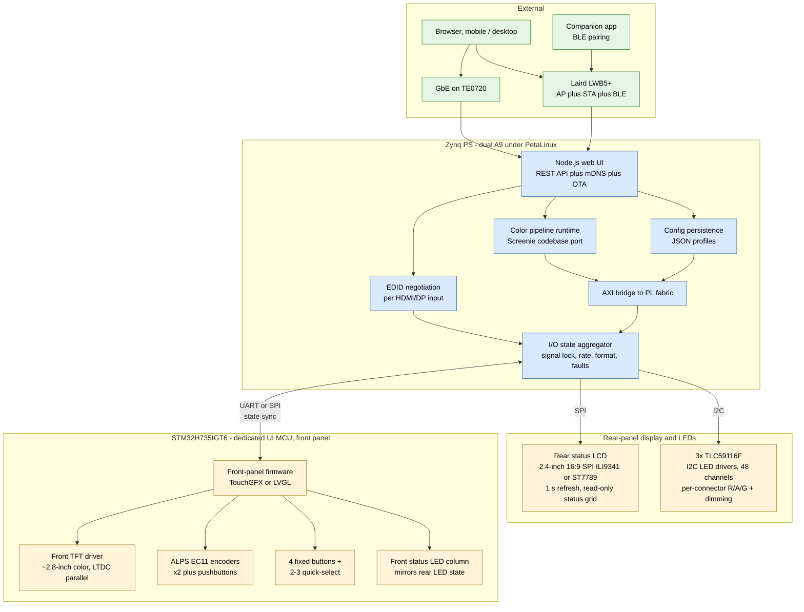

# Schindler 2.0 — Signal Flow

**Status:** Draft 2026-05-11
**Sources:** `docs/01-spec.md`, `hdl/*.v`, hardware architecture decisions through 2026-05-11
**Working level:** functional block diagram, not schematic. Wire-level connectivity belongs in the KiCad carrier schematic (later).

This doc captures three views:

1. **Video signal path** — pixels from any input to any output.
2. **Sync / genlock subsystem** — how the output pixel clock locks to an external reference.
3. **Control plane** — Zynq PS, UI MCU, and how the operator drives the box.

Mermaid block diagrams render natively in GitHub. To edit: change the source between the ` ```mermaid` fences and the rendered diagram updates on push.

---

## 1. Video signal path

```mermaid
flowchart LR
    classDef in fill:#d9eaff,stroke:#3a6ea5,color:#000
    classDef decode fill:#fff4d9,stroke:#a58634,color:#000
    classDef fpga fill:#e6f6e6,stroke:#3a8e3a,color:#000
    classDef out fill:#ffe2e2,stroke:#a54040,color:#000

    subgraph IN[Inputs - rear panel BNCs/HDMI]
        HDMI_IN[HDMI IN]:::in
        SDI_IN[SDI IN]:::in
        CVBS_IN[Composite IN]:::in
        YPBPR_IN[Component IN, YPbPr]:::in
    end

    subgraph DECODE[Front-end decoders]
        TPD_IN[TPD12S016 ESD]:::decode
        LT8619C[LT8619C HDMI RX<br/>parallel RGB to FPGA]:::decode
        GS3470[GS3470 SDI RX]:::decode
        ADV7280[ADV7280 analog decoder<br/>BT.656 YCbCr 4:2:2]:::decode
    end

    subgraph FPGA[Zynq-7020 FPGA fabric]
        VDMA[AXI VDMA<br/>DDR3 frame buffer]:::fpga
        SCALE[Polyphase scaler<br/>8-tap H / 4-tap V]:::fpga
        COLOR[Color pipeline<br/>1D LUT then 3x3 matrix then trim]:::fpga
        GEOM[Geometry<br/>pincushion / keystone / 4-corner warp]:::fpga
        TPG[Test pattern generator<br/>sample_gen.v]:::fpga
        TIMING[NTSC raster<br/>vid_timing.v + vbi_gen.v]:::fpga
        CHROMA[NTSC chroma<br/>chroma_gen.v]:::fpga
        MIX[Luma plus chroma combiner<br/>with saturation clamp]:::fpga
    end

    subgraph OUT[Outputs - rear panel]
        ADV7393[ADV7393 DAC<br/>composite / S-Video / component<br/>runtime-selectable]:::out
        HDMI_TX[HDMI 1.4 TX direct FPGA]:::out
        TPD_OUT[TPD12S016 ESD]:::out
        CVBS_OUT[Composite OUT BNC]:::out
        YPBPR_OUT[Component OUT BNCs]:::out
        HDMI_OUT[HDMI OUT]:::out
    end

    HDMI_IN --> TPD_IN --> LT8619C --> VDMA
    SDI_IN --> GS3470 --> VDMA
    CVBS_IN --> ADV7280
    YPBPR_IN --> ADV7280 --> VDMA

    VDMA --> SCALE --> COLOR --> GEOM --> MIX
    TPG --> MIX
    CHROMA --> MIX
    TIMING --> TPG
    TIMING --> CHROMA

    MIX --> ADV7393
    ADV7393 --> CVBS_OUT
    ADV7393 --> YPBPR_OUT
    MIX --> HDMI_TX --> TPD_OUT --> HDMI_OUT
```



**Notes**

- During Phase 2 bring-up the path in use is only **TIMING → TPG → CHROMA → MIX → R2R DAC on Pmod JC** (Zybo Z7-20). The blocks shown for VDMA / scaler / color / geometry / ADV7393 / HDMI TX are designed-in but not yet implemented.
- ADV7393 composite/S-Video and component output are **mutually exclusive at runtime** (I²C-switched). Both rear-panel BNC groups exist but only one is live at any moment.
- HDMI OUT is monitoring/analysis only (waveform/vectorscope visualization, signal lock dashboard, test pattern output, color analysis) — no HDCP encryption on output, per the legal positioning in changelog 9th update.

---

## 2. Sync / genlock subsystem

```mermaid
flowchart LR
    classDef in fill:#d9eaff,stroke:#3a6ea5,color:#000
    classDef analog fill:#fff4d9,stroke:#a58634,color:#000
    classDef digital fill:#e6f6e6,stroke:#3a8e3a,color:#000
    classDef clk fill:#f0d9ff,stroke:#6f3aa5,color:#000

    subgraph REFIN[Reference inputs - rear BNCs]
        REF_IN[REF IN BNC<br/>LTC / BB / tri-level autosense]:::in
        REF_LOOP[REF LOOP BNC<br/>passive loop-through]:::in
        SDI_REF[SDI ref via GS3470]:::in
    end

    subgraph FRONTEND[Analog front-end]
        CLAMP[Clamp diodes plus<br/>switchable 75 ohm term plus<br/>AC-coupled buffer plus<br/>switchable analog LPF]:::analog
        PGA[LTC6912 PGA<br/>2-channel, MIKROE-2555 bench]:::analog
        ADC[AD9204-20<br/>dual 10-bit 20 MSPS ADC]:::analog
    end

    subgraph CLASSIFY[Signal classification]
        FPGA_CLASS[FPGA classifier<br/>LTC biphase / BB line-rate / tri-level]:::digital
        RP2040[RP2040 slow-control<br/>autosense decision plus<br/>PGA gain commands plus<br/>Si5351 config plus<br/>status reporting]:::digital
    end

    subgraph PLL[Master clock]
        SI5351[Si5351 programmable<br/>clock generator<br/>ch0 to FPGA master clock]:::clk
        FPGA_MASTER[FPGA master clock<br/>locked to selected reference]:::clk
    end

    subgraph SYNCOUT[Dual SYNC OUT generation]
        ACC1[Per-OUT phase accumulator 1<br/>format and rate selectable]:::digital
        ACC2[Per-OUT phase accumulator 2<br/>format and rate selectable]:::digital
        WAVE1[Waveform gen 1<br/>BB / tri-level / LTC<br/>hardware-ready for DARS / WC]:::digital
        WAVE2[Waveform gen 2<br/>BB / tri-level / LTC<br/>hardware-ready for DARS / WC]:::digital
        DAC1[12-bit DAC<br/>AD9744 class or PWM plus LPF]:::analog
        DAC2[12-bit DAC<br/>AD9744 class or PWM plus LPF]:::analog
        DRV1[75 ohm cable driver<br/>ADV3000 / EL5170 / THS6212]:::analog
        DRV2[75 ohm cable driver<br/>ADV3000 / EL5170 / THS6212]:::analog
        OUT1[SYNC OUT 1 BNC]:::out
        OUT2[SYNC OUT 2 BNC]:::out
    end

    REF_IN --> CLAMP
    REF_IN -.passive.-> REF_LOOP
    CLAMP --> PGA --> ADC --> FPGA_CLASS
    FPGA_CLASS --> RP2040
    SDI_REF --> RP2040
    RP2040 --> SI5351 --> FPGA_MASTER
    FPGA_MASTER --> FPGA_OUT[Output video pipeline]:::digital

    FPGA_MASTER --> ACC1 --> WAVE1 --> DAC1 --> DRV1 --> OUT1
    FPGA_MASTER --> ACC2 --> WAVE2 --> DAC2 --> DRV2 --> OUT2

    classDef out fill:#ffe2e2,stroke:#a54040,color:#000
```



**Notes**

- Reference priority: LTC > tri-level > black burst > free-run.
- VITC is extracted from SDI ref by GS3470 / FPGA when SDI ref is selected, removing the need for a separate LTC cable.
- The 20 MSPS ADC stream goes to the FPGA for high-rate classification; RP2040 owns the slow-control decisions and PGA/Si5351 register writes.
- Loop bandwidth target ~0.5 Hz (slow enough to ignore jitter, fast enough to track drift — playbook Ch. 8).
- **Dual SYNC OUT design:** each OUT has its own FPGA phase accumulator ticking at the rate needed for its selected format and frame rate. Both phase-locked to the input reference via rational ratios. Si5351 channels 1 + 2 remain reserved — they are not consumed per-OUT because the per-OUT generation runs entirely in FPGA fabric off the master clock.
- **DARS / Word Clock readiness:** waveform gen blocks support adding these as firmware-only formats in a future rev. Driver chain spec (DC to ~10 MHz, ≥2 Vpp into 75 Ω) covers both. Word Clock will run at 1–2 Vpp not vintage 5 Vpp CMOS — accepted by all modern WC inputs.
- XLR balanced LTC IN/OUT dropped from V1; LTC routes through the autosense BNC input or OUT format selection.

---

## 3. Control plane



**Notes**

- Pi CM4 is **not** in V1 (dropped 2026-05-11). Zynq PS hosts everything Linux-side; UI MCU owns front panel.
- UI alive in <1 s from cold boot via UI MCU; Linux takes 15–30 s to boot behind the scenes with progress bar shown.
- All AXI traffic from PS to FPGA fabric (color matrix loads, EDID writes, mode changes, register pokes) goes through `PL_BRIDGE` — a single memory-mapped region with sequence numbers for atomic updates, same pattern as NovaTool / Screenie config systems.
- **`STATE` is the single source of truth for per-I/O status** (lock, rate, format, fault). It feeds three sinks: rear-panel LCD (SPI), per-connector LED drivers (I²C), and the front-panel UI MCU (UART or SPI state-sync). Front-panel LEDs mirror rear-panel LEDs so the operator sees identical state from front or back of the rack.

---

## TODO / refinements

- Add the V1.5 sync-conversion expansion blocks (LTC OUT, ref OUT, timecode-math module) — currently absent because spec marks them [PROPOSED] absorbed into V1.
- Add the SDI daughter card as a dashed-outline group in diagram 1 so the conditional population is visible.
- Add power tree as a fourth diagram (PSU → rails → consumers) once PSU style is decided.
- Once rear-panel I/O layout is settled, mirror it as a physical-panel diagram.
