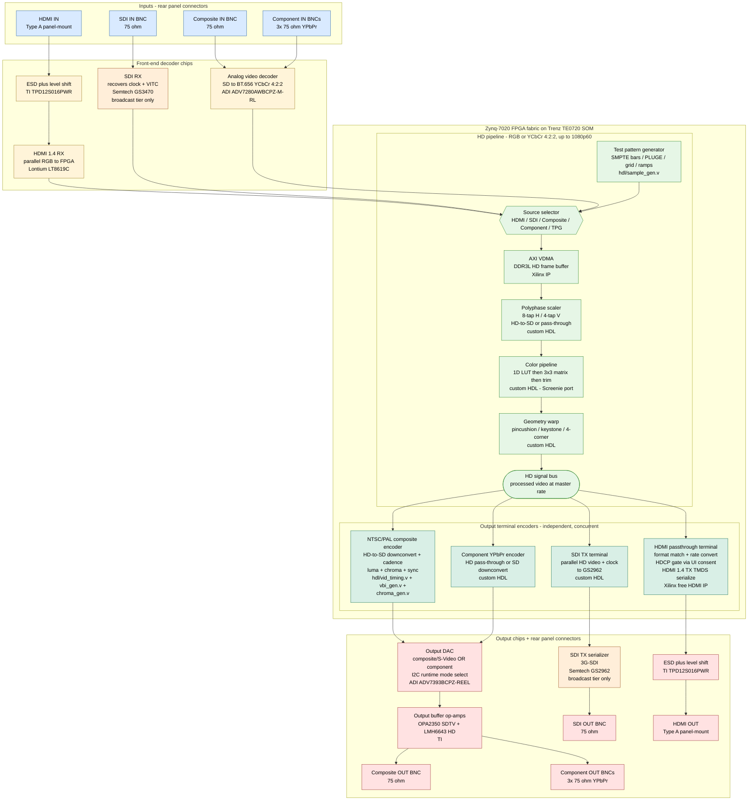
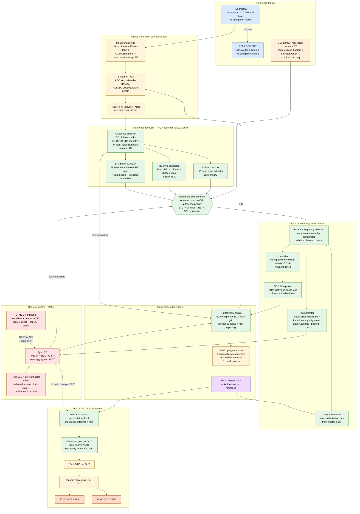
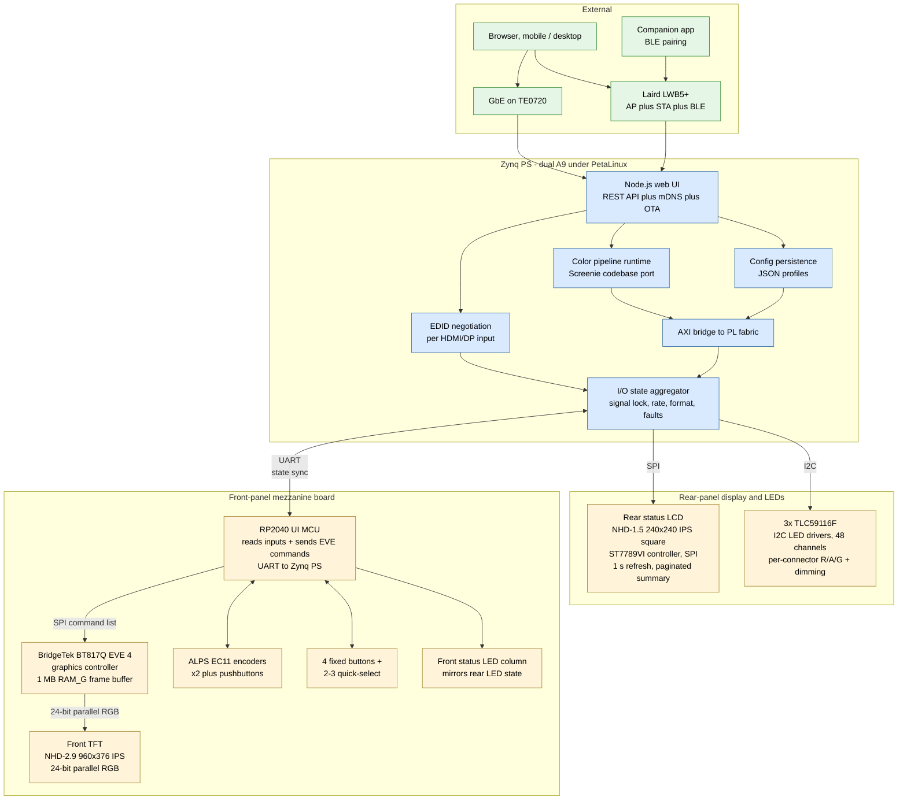

# Schindler 2.0 — Signal Flow

**Status:** Draft 2026-05-13
**Sources:** [`01-spec.md`](01-spec.md), [`packaging-skus.md`](packaging-skus.md), `hdl/*.v`
**Working level:** functional block diagram, not schematic. Wire-level connectivity belongs in the KiCad carrier schematic (later).

**SKU scope:** the three diagrams describe the **Pro v2** architecture (full silicon stuffing). Mini v1 is a subset — same diagrams, with the SDI subsystem unpopulated, no dual SYNC OUT driver chain, no per-connector LED drivers, no rear-LCD wiring, and a simpler control plane (PetaLinux on Zynq drives a mono OLED + buttons directly instead of the RP2040 + BT817Q mezzanine). Mini-specific differences called out per-diagram. See [`packaging-skus.md`](packaging-skus.md) for SKU stuffing matrix.

This doc captures three views:

1. **Video signal path** — pixels from any input to any output.
2. **Sync / genlock subsystem** — how the output pixel clock locks to an external reference.
3. **Control plane** — Zynq PS, UI MCU, and how the operator drives the box.

Mermaid block diagrams render natively in GitHub. To edit: change the source between the ` ```mermaid` fences and the rendered diagram updates on push.

---

## 1. Video signal path



**Notes**

- **The pipeline carries HD-bandwidth video throughout** (RGB or YCbCr 4:2:2, up to 1080p60 / 148.5 MHz pixel clock). Source resolution and rate are preserved through scaler / color / geometry; downconversion to SD or rate-conversion happens only inside the terminal encoder for outputs that demand it (composite, S-Video, SD component).
- **Outputs are independent and concurrent.** Same source video → multiple terminal encoders running simultaneously, each at its own format and rate. Example: 1080p60 HDMI source → 1080p60 HDMI OUT (passthrough) + NTSC composite OUT (downconvert + 5:2 cadence + encode) + HD component OUT (YPbPr) live simultaneously.
- **Terminal encoders are independent FPGA pipelines** consuming a shared HD signal bus. The composite encoder block contains the HDL we have today (`vid_timing.v`, `vbi_gen.v`, `chroma_gen.v`, `sample_gen.v`); HDMI / YPbPr / SDI terminals haven't been written yet.
- **HDMI OUT is full-quality HD passthrough** (1080p60 / 1080p24 / etc) — NOT a degraded monitoring view. **HDCP-protected content is blocked from HDMI OUT by default** at the HDMI passthrough terminal. Operator can override via a UI consent dialog ("I attest this is a non-violating use") which unlocks full-quality HDMI passthrough for protected content. Attorney-advised posture — keeps liability with the operator. Non-protected content flows through HDMI OUT without any gate.
- **`SOURCE_MUX`** picks one input (HDMI / SDI / composite / component) OR the internal test pattern generator. Operator selects via UI; TPG is the default at power-on before any source is connected.
- **ADV7393 composite/S-Video and component output are mutually exclusive at runtime** (I²C-switched). The COMP_TERM and YPBPR_TERM blocks feed into the DAC, but only the one matching the selected output mode is active on the analog BNCs at any moment.
- **SDI chips (GS3470, GS2962) are broadcast-tier only** — colored orange. Every V1 carrier has the footprints; broadcast units have them populated, base units do not. Daughter-card delivery on headers is the field-upgrade vector (see `01-spec.md` SDI daughter card section).
- **GS3470 also feeds the genlock subsystem** (SDI recovered clock + VITC extraction) — see diagram 2.
- **Phase 2 bring-up uses a degenerate version of this pipeline:** TPG → COMP_TERM directly (no scaler/color/geometry, no real source mux, no HD bus), driving the Zybo R2R DAC for first-light NTSC composite. The full HD pipeline is built incrementally after first-light.

---

## 2. Sync / genlock subsystem



**Notes**

- **The genlock loop is fully digital** — FPGA fabric implements the phase/frequency detector, loop filter, NCO/integrator, and lock detector. Si5351 is the only physical clock generator; the integrator's accumulated correction is pushed to Si5351 via RP2040 over I²C as slow-control updates.
- **No dedicated "SDI ref" input.** SDI reference is derived from the SDI VIDEO IN via GS3470's recovered clock + VITC extraction, on broadcast-tier units only. This unifies the SDI path: one input connector serves video data + reference. The earlier scoping treating SDI as its own ref-input channel is obsolete. The GS3470 block appears in both diagrams 1 and 2 — same chip, two roles — colored orange in both to indicate it's the broadcast-tier-only SDI silicon.
- **Autosense classifier** runs continuously on the 20 MSPS ADC stream; identifies signal type by characteristic signature (LTC biphase pattern, BB 15.734 kHz line rate + 3.58 MHz burst, tri-level pulse pattern) and routes the corresponding decoder output into the reference selector mux.
- **Per-format decoders** sit between the classifier and the mux:
  - `LTC_DEC` — biphase mark demod, sync word 0xBFFC detection, frame edge extraction, timecode parser
  - `BB_DEC` — sync separator (H/V/colorburst), line/field extraction
  - `TRI_DEC` — HD sync edge extractor for tri-level
  - `GS3470_REF` — recovered clock + VITC from GS3470 (broadcast tier only, orange); shown in REFIN as a separate "input" since conceptually it's a reference source even though physically it's the same chip handling SDI video data in diagram 1.
- **Reference selector mux** is operator-controlled via Zynq PS (front panel or web UI) with an autosense-priority fallback (LTC > tri-level > BB > SDI > free-run). Operator can pin a specific source or let autosense pick.
- **Loop filter bandwidth default 0.5 Hz** — slow enough to ignore reference jitter, fast enough to track drift (playbook Ch. 8). Configurable via UI for tighter tracking when needed.
- **NCO holds last value on reference loss** — produces free-run / hold behavior so the output stays clean while the operator reconnects or switches sources. Lock detector reports "Lost" state; UI flags the missing reference.
- **Lock detector** outputs a 3-state machine (Acquiring / Locked / Lost) plus a continuous quality metric (phase-error magnitude + 1 s standard deviation). Both flow up to Zynq PS, which aggregates and pushes to the rear status LCD, per-connector LEDs, front-panel UI MCU, and web UI.
- **Operator control surface (front panel + web UI):**
  - Reference source selection (auto / LTC / BB / tri-level / SDI / free-run / hold)
  - Loop filter bandwidth tweak (default / tight / wide)
  - Per-OUT format selection (BB / tri-level / LTC; DARS / WC hardware-ready)
  - Per-OUT frame rate selection (24 / 23.976 / 25 / 29.97 / 30, drop-frame TC modes)
  - Lock state + quality readout (real-time, on TFT and web UI)
- **Dual SYNC OUT design** — each OUT has its own FPGA phase accumulator ticking at the rate needed for its selected format and frame rate; both phase-locked to the master clock via rational ratios. Both can target independent rates simultaneously (V1.5 sync conversion absorbed into V1). Si5351 ch1/ch2 stay reserved (future GPSDO 10 MHz distribution).
- **DARS / Word Clock readiness** — waveform gen + driver chain support both as firmware-only future formats. Driver bandwidth DC to ~10 MHz, output swing ≥2 Vpp into 75 Ω. Word Clock at 1–2 Vpp, not vintage 5 Vpp CMOS — accepted by all modern WC inputs.
- **XLR balanced LTC IN/OUT dropped from V1**; LTC routes through the autosense BNC input or via OUT format selection.

---

## 3. Control plane



**Notes**

- Pi CM4 is **not** in V1 (dropped 2026-05-11). Zynq PS hosts everything Linux-side; front-panel mezzanine owns the front panel.
- **Front panel is its own mezzanine board** (revised 2026-05-11). RP2040 reads encoders + buttons + drives the front-panel LED column. EVE 4 (BT817Q) handles all graphics — RP2040 sends high-level draw commands; EVE holds the frame in 1 MB internal RAM_G and refreshes the NHD-2.9 over 24-bit parallel RGB autonomously. STM32H735 retires from V1. Mezzanine ↔ main carrier link is UART + power only.
- UI alive in <1 s from cold boot via RP2040 (no Linux dependency). Main system can take 15–30 s to boot Linux behind the scenes with progress bar shown on the front TFT.
- All AXI traffic from PS to FPGA fabric (color matrix loads, EDID writes, mode changes, register pokes) goes through `PL_BRIDGE` — a single memory-mapped region with sequence numbers for atomic updates, same pattern as NovaTool / Screenie config systems.
- **`STATE` is the single source of truth for per-I/O status** (lock, rate, format, fault). It feeds three sinks: rear-panel LCD (SPI), per-connector LED drivers (I²C), and the front-panel mezzanine RP2040 (UART state-sync). Front-panel LEDs mirror rear-panel LEDs so the operator sees identical state from front or back of the rack.

---

## TODO / refinements

- Add the V1.5 sync-conversion expansion blocks (LTC OUT, ref OUT, timecode-math module) — currently absent because spec marks them [PROPOSED] absorbed into V1.
- Add the SDI daughter card as a dashed-outline group in diagram 1 so the conditional population is visible.
- Add power tree as a fourth diagram (PSU → rails → consumers) once PSU style is decided.
- Once rear-panel I/O layout is settled, mirror it as a physical-panel diagram.
