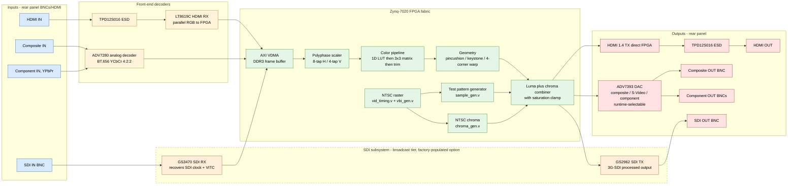
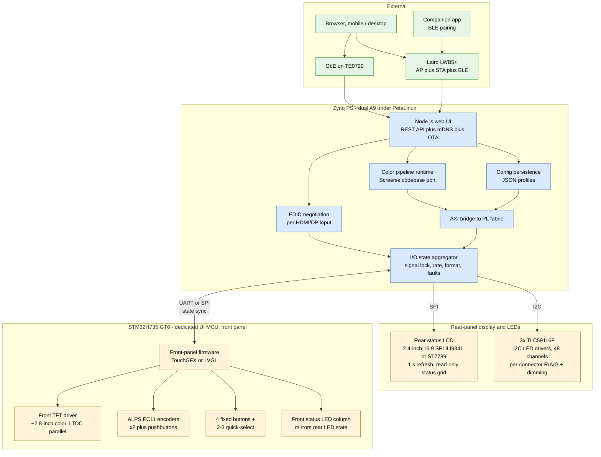

# Schindler 2.0 — Signal Flow

**Status:** Draft 2026-05-11
**Sources:** `docs/01-spec.md`, `hdl/*.v`, hardware architecture decisions through 2026-05-11
**Working level:** functional block diagram, not schematic. Wire-level connectivity belongs in the KiCad carrier schematic (later).

This doc captures three views:

1. **Video signal path** — pixels from any input to any output.
2. **Sync / genlock subsystem** — how the output pixel clock locks to an external reference.
3. **Control plane** — Zynq PS, UI MCU, and how the operator drives the box.

Mermaid block diagrams render natively in GitHub. To edit: change the source between the ` ```mermaid` fences and the rendered diagram updates on push.

---

## 1. Video signal path



**Notes**

- During Phase 2 bring-up the path in use is only **TIMING → TPG → CHROMA → MIX → R2R DAC on Pmod JC** (Zybo Z7-20). The blocks shown for VDMA / scaler / color / geometry / ADV7393 / HDMI TX / SDI are designed-in but not yet implemented.
- ADV7393 composite/S-Video and component output are **mutually exclusive at runtime** (I²C-switched). Both rear-panel BNC groups exist but only one is live at any moment.
- HDMI OUT is monitoring/analysis only (waveform/vectorscope visualization, signal lock dashboard, test pattern output, color analysis) — no HDCP encryption on output, per the legal positioning in changelog 9th update.
- **SDI subsystem (dashed outline)** is a **factory-populated hardware option** per the broadcast tier — every V1 carrier has the footprints; broadcast units have GS3470 + GS2962 + 2× SDI BNCs populated, base units do not. Daughter-card delivery on headers is a candidate field-upgrade path (see `01-spec.md` SDI daughter card section). GS3470 also feeds the genlock subsystem (SDI ref + VITC extraction) — see diagram 2.
- **SDI OUT is processed**, not a passive loop-through. The signal goes through the full FPGA color / geometry pipeline and is re-serialized by GS2962. Passive loop-through was dropped from V1 in the 2026-05-11 connector simplification.

---

## 2. Sync / genlock subsystem

```mermaid
flowchart LR
    classDef in fill:#d9eaff,stroke:#3a6ea5,color:#000
    classDef analog fill:#fff4d9,stroke:#a58634,color:#000
    classDef digital fill:#e6f6e6,stroke:#3a8e3a,color:#000
    classDef clk fill:#f0d9ff,stroke:#6f3aa5,color:#000
    classDef ctrl fill:#ffe2e2,stroke:#a54040,color:#000
    classDef sdi fill:#ffeed9,stroke:#a56234,color:#000
    classDef out fill:#ffd9c9,stroke:#a55a2c,color:#000

    subgraph REFIN[Reference inputs - rear panel]
        REF_IN[REF IN BNC<br/>autosense - LTC / BB / tri-level]:::in
        REF_LOOP[REF LOOP BNC<br/>passive loop-through]:::in
        SDI_VID_X[SDI VIDEO IN<br/>cross-ref from diagram 1<br/>broadcast tier only]:::sdi
    end

    subgraph FE[Analog front-end - autosense path]
        CLAMP[Input conditioning<br/>clamp diodes + 75 ohm term +<br/>AC-coupled buffer +<br/>switchable analog LPF]:::analog
        PGA[LTC6912 PGA<br/>2-channel programmable gain<br/>AGC loop driven by classifier]:::analog
        ADC[AD9204-20<br/>dual 10-bit 20 MSPS ADC]:::analog
    end

    subgraph CLASSIFY[Reference recovery - FPGA fabric]
        AUTOSENSE[Autosense classifier<br/>LTC biphase mark +<br/>BB 15.734 kHz line rate +<br/>tri-level pulse signature]:::digital
        LTC_DEC[LTC frame decoder<br/>biphase demod + 0xBFFC sync<br/>+ frame edge + TC parser]:::digital
        BB_DEC[BB sync separator<br/>line + field + colorburst<br/>phase extract]:::digital
        TRI_DEC[Tri-level decoder<br/>HD sync edge extractor]:::digital
        SDI_DEC[SDI recovered clock + VITC<br/>derived from GS3470<br/>not a separate ref input]:::sdi
    end

    REF_MUX{{Reference selector mux<br/>operator override OR autosense priority<br/>LTC -> tri-level -> BB -> SDI -> free-run}}:::digital

    subgraph LOOP[Digital genlock loop core - FPGA]
        DIVN[Output divider /N<br/>match selected ref rate<br/>from master clock]:::digital
        PHASE_DET[Phase + frequency detector<br/>sample-and-hold edge comparator<br/>sub-line phase accuracy]:::digital
        LOOP_FILT[Loop filter<br/>configurable bandwidth<br/>default ~0.5 Hz<br/>playbook Ch. 8]:::digital
        INTEG[NCO / integrator<br/>holds last value on ref loss<br/>= free-run hold behavior]:::digital
        LOCK_DET[Lock detector<br/>phase-error magnitude +<br/>1 s stddev = quality metric<br/>state: Acquiring / Locked / Lost]:::digital
    end

    subgraph CLK[Master clock generation]
        RP2040[RP2040 slow-control<br/>I2C config of Si5351 + PGA gain<br/>autosense status + lock reporting]:::digital
        SI5351[Si5351 programmable<br/>3-channel clock generator<br/>ch0 to FPGA master<br/>ch1 + ch2 reserved]:::analog
        FPGA_MASTER[FPGA master clock<br/>locked to selected reference]:::clk
    end

    subgraph UI[Operator control + status]
        UIMCU[UI MCU front panel<br/>encoders + buttons + TFT<br/>source select + per-OUT config]:::ctrl
        ZYNQ_PS[Zynq PS<br/>web UI + REST API +<br/>state aggregator SSOT]:::ctrl
        STATUS[Rear LCD + per-connector LEDs<br/>selected source + lock state +<br/>quality metric + rates]:::ctrl
    end

    subgraph SYNCOUT[Dual SYNC OUT generation]
        ACC[Per-OUT phase accumulators 1 + 2<br/>independent format + rate]:::digital
        WAVE[Waveform gen per OUT<br/>BB / tri-level / LTC<br/>HW-ready for DARS / WC]:::digital
        DAC[12-bit DAC per OUT]:::analog
        DRV[75 ohm cable driver per OUT]:::analog
        OUT1[SYNC OUT 1 BNC]:::out
        OUT2[SYNC OUT 2 BNC]:::out
    end

    %% Reference signal path
    REF_IN --> CLAMP
    REF_IN -.passive.-> REF_LOOP
    CLAMP --> PGA --> ADC --> AUTOSENSE
    AUTOSENSE --> LTC_DEC
    AUTOSENSE --> BB_DEC
    AUTOSENSE --> TRI_DEC
    SDI_VID_X --> SDI_DEC

    %% Reference selection
    LTC_DEC --> REF_MUX
    BB_DEC --> REF_MUX
    TRI_DEC --> REF_MUX
    SDI_DEC --> REF_MUX

    %% Closed PLL loop
    REF_MUX --> PHASE_DET
    FPGA_MASTER --> DIVN --> PHASE_DET
    PHASE_DET --> LOOP_FILT --> INTEG
    PHASE_DET --> LOCK_DET
    INTEG --> RP2040
    RP2040 --> SI5351 --> FPGA_MASTER

    %% Slow-control side
    AUTOSENSE -->|gain command| RP2040
    RP2040 -->|I2C| PGA

    %% Operator + status
    LOCK_DET --> ZYNQ_PS
    RP2040 <--> ZYNQ_PS
    UIMCU <-->|UART or SPI<br/>state sync| ZYNQ_PS
    ZYNQ_PS -->|source override| REF_MUX
    ZYNQ_PS -->|format + rate per OUT| ACC
    ZYNQ_PS --> STATUS

    %% Sync OUT path
    FPGA_MASTER --> ACC --> WAVE --> DAC --> DRV
    DRV --> OUT1
    DRV --> OUT2

    style SDI_VID_X stroke-dasharray: 5 5
    style SDI_DEC stroke-dasharray: 5 5
```



**Notes**

- **The genlock loop is fully digital** — FPGA fabric implements the phase/frequency detector, loop filter, NCO/integrator, and lock detector. Si5351 is the only physical clock generator; the integrator's accumulated correction is pushed to Si5351 via RP2040 over I²C as slow-control updates.
- **No dedicated "SDI ref" input.** SDI reference is derived from the SDI VIDEO IN via GS3470's recovered clock + VITC extraction, on broadcast-tier units only. This unifies the SDI path: one input connector serves video data + reference. The earlier scoping treating SDI as its own ref-input channel is obsolete. SDI-related elements in the diagram are dashed to indicate broadcast-tier conditional population.
- **Autosense classifier** runs continuously on the 20 MSPS ADC stream; identifies signal type by characteristic signature (LTC biphase pattern, BB 15.734 kHz line rate + 3.58 MHz burst, tri-level pulse pattern) and routes the corresponding decoder output into the reference selector mux.
- **Per-format decoders** sit between the classifier and the mux:
  - `LTC_DEC` — biphase mark demod, sync word 0xBFFC detection, frame edge extraction, timecode parser
  - `BB_DEC` — sync separator (H/V/colorburst), line/field extraction
  - `TRI_DEC` — HD sync edge extractor for tri-level
  - `SDI_DEC` — recovered clock + VITC from GS3470 (broadcast tier only, dashed)
- **Reference selector mux** is operator-controlled via Zynq PS (front panel or web UI) with an autosense-priority fallback (LTC > tri-level > BB > SDI > free-run). Operator can pin a specific source or let autosense pick.
- **Loop filter bandwidth default 0.5 Hz** — slow enough to ignore reference jitter, fast enough to track drift (playbook Ch. 8). Configurable via UI for tighter tracking when needed.
- **NCO holds last value on reference loss** — produces free-run / hold behavior so the output stays clean while the operator reconnects or switches sources. Lock detector reports "Lost" state; UI flags the missing reference.
- **Lock detector** outputs a 3-state machine (Acquiring / Locked / Lost) plus a continuous quality metric (phase-error magnitude + 1 s standard deviation). Both flow up to Zynq PS, which aggregates and pushes to the rear status LCD, per-connector LEDs, front-panel UI MCU, and web UI.
- **Operator control surface (front panel + web UI):**
  - Reference source selection (auto / LTC / BB / tri-level / SDI / free-run / hold)
  - Loop filter bandwidth tweak (default / tight / wide)
  - Per-OUT format selection (BB / tri-level / LTC; DARS / WC hardware-ready)
  - Per-OUT frame rate selection (24 / 23.976 / 25 / 29.97 / 30, drop-frame TC modes)
  - Lock state + quality readout (real-time, on TFT and web UI)
- **Dual SYNC OUT design** — each OUT has its own FPGA phase accumulator ticking at the rate needed for its selected format and frame rate; both phase-locked to the master clock via rational ratios. Both can target independent rates simultaneously (V1.5 sync conversion absorbed into V1). Si5351 ch1/ch2 stay reserved (future GPSDO 10 MHz distribution).
- **DARS / Word Clock readiness** — waveform gen + driver chain support both as firmware-only future formats. Driver bandwidth DC to ~10 MHz, output swing ≥2 Vpp into 75 Ω. Word Clock at 1–2 Vpp, not vintage 5 Vpp CMOS — accepted by all modern WC inputs.
- **XLR balanced LTC IN/OUT dropped from V1**; LTC routes through the autosense BNC input or via OUT format selection.

---

## 3. Control plane



**Notes**

- Pi CM4 is **not** in V1 (dropped 2026-05-11). Zynq PS hosts everything Linux-side; UI MCU owns front panel.
- UI alive in <1 s from cold boot via UI MCU; Linux takes 15–30 s to boot behind the scenes with progress bar shown.
- All AXI traffic from PS to FPGA fabric (color matrix loads, EDID writes, mode changes, register pokes) goes through `PL_BRIDGE` — a single memory-mapped region with sequence numbers for atomic updates, same pattern as NovaTool / Screenie config systems.
- **`STATE` is the single source of truth for per-I/O status** (lock, rate, format, fault). It feeds three sinks: rear-panel LCD (SPI), per-connector LED drivers (I²C), and the front-panel UI MCU (UART or SPI state-sync). Front-panel LEDs mirror rear-panel LEDs so the operator sees identical state from front or back of the rack.

---

## TODO / refinements

- Add the V1.5 sync-conversion expansion blocks (LTC OUT, ref OUT, timecode-math module) — currently absent because spec marks them [PROPOSED] absorbed into V1.
- Add the SDI daughter card as a dashed-outline group in diagram 1 so the conditional population is visible.
- Add power tree as a fourth diagram (PSU → rails → consumers) once PSU style is decided.
- Once rear-panel I/O layout is settled, mirror it as a physical-panel diagram.
