# Architecture

The Schindler 2.0 pipeline on iter5-1080p-clean substrate.

## Pipeline topology

```mermaid
graph LR
    %% Input chain
    HDMIIN([HDMI IN]) --> DVI2RGB[dvi2rgb<br/>TMDS RX]
    DVI2RGB --> VVI[v_vid_in_axi4s<br/>vid_io → AXIS]
    VVI --> SCALER[scaler_top<br/>1920×1080 → 1280×720<br/>2-tap boxcar H+V]
    SCALER --> VDMA_S[axi_vdma S2MM<br/>Dynamic Master]

    %% Memory ring
    VDMA_S --> DDR3[(DDR3 framestore ring<br/>5 slots × 1280×720×3<br/>iter6 hardware fsync)]
    DDR3 --> VDMA_M[axi_vdma MM2S<br/>Dynamic Slave<br/>repeat_en]

    %% Output chain
    VDMA_M --> COLOR_SAT[color_saturation<br/>Q1.15 0..200%]
    COLOR_SAT --> COLOR_COR[color_correct<br/>per-channel black/white]
    COLOR_COR --> COLOR_MAT[color_matrix<br/>3×3 Q2.14 + offsets]
    COLOR_MAT --> AXIS_OUT[axis_to_vid_io<br/>AXIS → vid_io]
    AXIS_OUT --> RGB2DVI[rgb2dvi<br/>TMDS TX]
    RGB2DVI --> HDMIOUT([HDMI OUT])

    %% VTC timing
    VTC_TX[v_tc_tx<br/>output VTC<br/>720p60 timing] -.->|active_video, hsync, vsync| AXIS_OUT
    VTC_TX -.->|fsync| VDMA_M

    %% Detector + diagnostic
    VVI -.->|vtiming_out| VTC_RX[v_tc_rx<br/>source format detector]
    VTC_RX -.->|HACTIVE/VACTIVE via AXI GPIO| SCALER

    %% Hardware fsync (iter6)
    DVI2RGB -.->|vid_pVSync| VSYNC_PULSE[vsync_cdc_pulse<br/>rising-edge → 1cyc pulse]
    VSYNC_PULSE -.->|s2mm_fsync| VDMA_S

    %% AXI control plane
    PS[Zynq PS<br/>bare-metal C<br/>VDMA init, color tuning,<br/>UART command parser] -.->|AXI-Lite| VDMA_S
    PS -.->|AXI-Lite| VDMA_M
    PS -.->|AXI-Lite| VTC_TX
    PS -.->|AXI-Lite| VTC_RX
    PS -.->|GPIOs 3/4/5/6| COLOR_SAT
    PS -.->|GPIOs 3/4/5/6| COLOR_COR
    PS -.->|GPIOs 3/4/5/6| COLOR_MAT

    %% Styling
    classDef input fill:#1e4d2b,stroke:#0a2e15,color:#fff
    classDef memory fill:#4d3719,stroke:#2e2010,color:#fff
    classDef output fill:#4d1e3a,stroke:#2e0f23,color:#fff
    classDef control fill:#1e3a4d,stroke:#102330,color:#fff
    class HDMIIN,HDMIOUT input
    class DDR3 memory
    class RGB2DVI,AXIS_OUT,VTC_TX output
    class PS,VTC_RX,VSYNC_PULSE control
```



### Plain-text fallback (in case the renderer doesn't do Mermaid)

```
HDMI IN
  │
  └─► dvi2rgb ──► v_vid_in_axi4s ──► scaler_top ──► axi_vdma S2MM
                                       │              │
                                       │              ▼
                                       │           DDR3 frame buffer (5-slot ring, Dynamic Genlock)
                                       │              │
                                       │              ▼
                                       │           axi_vdma MM2S
                                       │              │
                                       │              ▼
                                       └────────► color pipeline (sat → correct → matrix)
                                                      │
                                                      ▼
                                                axis_to_vid_io
                                                      │
                                                      ▼
                                             v_tc_tx (VTC timing)
                                                      │
                                                      ▼
                                                  rgb2dvi ──► HDMI OUT
```

Built by `../../tcl/build_phase_b.tcl` (~1000 lines, 47 BD cells, 227 BD wire ops). Top-level wrapper: `phase_b_top.v`.

## Clock domains

| Domain | Rate | Source | Used by |
|---|---|---|---|
| `pclk_in` | dvi2rgb-derived (e.g., 148.5 MHz at 1080p60) | dvi2rgb internal MMCM | scaler, S2MM input side |
| `pclk_out` | 74.25 MHz at 720p60 | `clk_wiz_pixclk_out` MMCM | VTC TX, axis_to_vid_io, color pipeline, rgb2dvi |
| `ref_clk_200` | 200 MHz | `clk_wiz_ref` PLL | IDELAYCTRL for dvi2rgb |
| `axi_clk` | 100 MHz | Zynq PS FCLK_CLK0 | AXI-Lite + DMA control plane |

Async crossings handled via `hdl/axi_sync_inputs.v` (multi-flop sync per port) + `hdl/vsync_cdc_pulse.v` (edge-detect pulse generator). Both are well-trodden; see [XILINX-IP-NOTES](XILINX-IP-NOTES.md) for the CDC width-mismatch trap.

## AXIS pixel format

**Important:** the pipeline carries pixels as `tdata[23:16] = R, [15:8] = B, [7:0] = G` — **not** standard RGB. This is a Digilent dvi2rgb byte-order quirk discovered empirically. Any channel-aware HDL (color matrix, YCbCr conversion, gamma LUT, etc.) must respect this layout.

Documented in memory `pipeline_rbg_byte_order`.

## Scaler

`hdl/scaler_top.v` wraps `scaler_h.v` (horizontal, 1920→1280 hardcoded) + `scaler_v.v` (vertical, 1280→720 hardcoded). Internal lbuf BRAMs absorb input-row timing.

**Current production kernel (iter12 + iter13 + iter13b):**
- H: 2-tap boxcar `(s_axis_tdata + window[0] + 1) >> 1`. Newest tap is the freshly arriving pixel; oldest is the registered previous pixel.
- V: 2-tap boxcar `(tap2 + tap3 + 1) >> 1` post-`tap0_slot` rotation.
- The `+1` is round-to-nearest, fixing the −0.5 LSB DC bias the truncating `>>1` introduced.

History of why this kernel: see [PHASES](PHASES.md) iter ledger + `../iter6-h-shift-analysis.md` (RESOLVED banner explains the bug class).

## VDMA configuration

`axi_vdma_0` runs **Dynamic Genlock** mode (S2MM mode=2 = Dynamic Master, MM2S mode=3 = Dynamic Slave with `repeat_en`, FrameDelay=1). 5-slot framestore ring.

iter6 added hardware S2MM fsync (`c_use_s2mm_fsync=1` + `c_flush_on_fsync=1`) driven by a 1-cycle pulse on rising edge of `dvi2rgb_0/vid_pVSync`. Bypasses the ~27-row internal TUSER-detect pipeline lag.

## Color pipeline

Three stages between MM2S and `axis_to_vid_io`, all runtime-tunable via UART:
1. `color_saturation` (Q1.15 saturation 0..200%)
2. `color_correct` (per-channel black/white knobs — diagonal RGB matrix)
3. `color_matrix` (full 3×3 Q2.14 matrix + 8-bit offsets)

See [COLOR-PIPELINE](COLOR-PIPELINE.md) for stage details + UART command reference.

## Output side

`axis_to_vid_io` adapts AXIS-Video to discrete vid_data/vid_sync. `v_tc_tx` (Xilinx VTC) generates timing. `rgb2dvi` (Digilent) drives the HDMI TX TMDS.

## Memory layout (DDR3 at 0x1000_0000)

| Region | Use |
|---|---|
| Slot 0..4 (5 × frame size + STRIDE) | VDMA framestore ring. Each slot = `FRAME_BYTES + STRIDE` for guard region. |

`FRAME_H × STRIDE` per slot; STRIDE = `1280 × 3` bytes for 720p RGB24. Computed in firmware (`sw/phase-b/src/main.c`).

## Sub-pages for deeper detail

- [FRC-ARCHITECTURE](FRC-ARCHITECTURE.md) — Methods A/B/C/D/E, RT4K three-mode framing
- [COLOR-PIPELINE](COLOR-PIPELINE.md) — color stack details
- [XILINX-IP-NOTES](XILINX-IP-NOTES.md) — IP-specific gotchas

<!-- AGENT_TASK[docs-4] DONE 2026-05-31: Mermaid block diagram added at top of "Pipeline topology" section. Shows all major BD cells + AXI-Lite control plane + VTC timing + iter6 fsync wiring. ASCII version retained as plain-text fallback for non-Mermaid renderers. -->

<!-- AGENT_TASK[hdl-3]: scaler_coeffs_h.v + scaler_coeffs_v.v are now dead code kept alive only by `_coef_keep` synth-keep wires. When iter14 lands, these come back online with new (linear/Gaussian) coefficients. Tech debt: document the decision to keep vs. retire. -->
