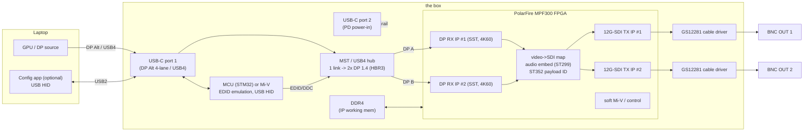

# 02 — System Architecture

> **Architecture = FPGA-based (Microchip PolarFire).** The fixed-function bridge
> design (Semtech GS12170) is dead — the part is EOL (Feb 2025) with no single-chip
> replacement (`06` Q0). Conversion now lives in a **PolarFire FPGA** using
> Microchip's **free 12G-SDI IP**. V1 is **conversion-only** (source-locked, no
> frame manipulation); the FPGA also makes the future "smart" features (active
> frame-rate conversion, color, genlock) an unlock rather than a respin.

## Signal path, end to end (V1)

**No SOM.** PolarFire is a raw FPGA on the board (the MPF300 video kit proves the
design; production is the bare `MPF300T-FCG484`/`1152` + DDR4 + SPI flash on a
6–8 layer board). DDR is present for the SDI/Mi-V subsystem, **not** as a frame
buffer for rate conversion — V1 stays source-locked (see Clocking).

## Block-by-block

### 1. USB-C front end
USB-C DP Alt Mode (4-lane HBR3) or USB4, negotiated by a **TI TPS65987D**-class
PD/Alt-Mode controller. USB 2.0 sideband → MCU for HID config.

### 2. Front-end hub — split one USB-C into two **DP** streams
Still required; unchanged by the FPGA decision *except* that we now want **DP
outputs** (to feed the PolarFire DP-RX, which does 4K60 — the HDMI-RX path caps
at 4K30). See `04` Block 2 and the platform note below.
- **DP-output hubs (preferred):** Parade **PS8650**, Synaptics **VMM5330**.
- **USB4 hub** for Mac independent-dual: Realtek **RTS5490** (DP-tunneled out).
- Each output owns an **EDID/DDC channel** the MCU controls (`03`).

### 3. Conversion — **PolarFire FPGA (DP-RX → 12G-SDI), no bridge chip**
The EOL of the GS12170 moves conversion into the FPGA — which is how the rest of
the industry already builds these (Blackmagic = Spartan/Artix). Per channel:
1. **DisplayPort RX IP** (DP 1.4, **HBR3 8.1 Gb/s/lane, SST → 4K60 4:2:2**).
   ⚠️ Use DP, **not** HDMI: Microchip's HDMI RX IP caps at **4K30** (`06` Q0a).
2. Map recovered video → SMPTE serial-digital raster; **embed audio (ST 299)**;
   insert **ST 352 payload ID**.
3. **12G-SDI TX IP** (Microchip, **free**; SMPTE 1.5G/3G/6G/12G, ST 2082-1) →
   serial out.
- One **MPF300 (300K LE)** hosts **both** channels (2× DP-RX + 2× SDI-TX) + a soft
  **Mi-V** control core. Resource fit at 2 channels is a **diligence item** (`06`).
- **HDCP:** we ship as a **non-HDCP sink** (`06` Q11) — the DP-RX must be
  configured to not authenticate HDCP, so it only ever sees unprotected streams.

### 4. SDI cable driver
**Semtech GS12281** 12G reclocking driver per output → 75 Ω BNC (survives; it's an
SDI-PHY part, not the dead bridge). Cleans the FPGA transceiver's SDI output to
meet ST 2082 over coax.

### 5. Management MCU / control
EDID emulation on the hub DDC channels + USB HID + status. Either a discrete
**STM32** or a **soft Mi-V** core inside the PolarFire (the SDI demo already
instantiates a Mi-V). Discrete MCU = simpler bring-up; Mi-V = fewer parts.

## Host platform support — the MST-vs-USB4 fork (defining, `06` Q-MAC)
Unchanged by the FPGA move. **macOS does not do MST extended (mirrors)** — so an
**MST** hub gives two-independent on Windows but mirror-only on Mac; **USB4
(RTS5490)** gives independent dual on Mac (M4+/Pro/Max) and Windows. The market
moat is the "presents-as-displays" behavior **and** Mac support (`01`).

| Front end | Win/Linux indep. | Mac indep. | FPGA input | 
|---|---|---|---|
| MST hub (PS8650/VMM5330) | ✅ | ❌ mirror | DP → DP-RX |
| USB4 hub (RTS5490) | ✅ | ✅ (M4+) | DP-tunneled → DP-RX |

## Link-bandwidth budget (DP/host side — unchanged)
DP 1.4 HBR3, 4 lanes = **25.92 Gb/s usable**, shared across both streams.

| Format | Rate/stream | Two streams | Fits 4-lane HBR3? |
|---|---|---|---|
| 1080p59.94 4:2:2 10b | 2.49 Gb/s | 4.97 Gb/s | ✅ |
| 2160p30 4:2:2 10b | 4.97 Gb/s | 9.95 Gb/s | ✅ |
| 2160p59.94 4:2:2 10b | 9.95 Gb/s | 19.9 Gb/s | ✅ with blanking margin |

Headline: two independent outputs up to **2160p59.94 4:2:2 10-bit** = exactly
what 12G-SDI carries (ST 2082-10).

### Graceful degradation ladder (host/link-driven, via EDID)
1. Dual 2160p59.94 → 2. Single 2160p mirrored → 3. Dual 1080p59.94 →
4. Single 1080p mirrored. Advertised via EDID; operator can pin a rung.

## Clocking — source-locked, NO frame repeat/drop (V1)
Even with an FPGA + DDR, **V1 is genlocked to the source**: the SDI output clock
is locked to the recovered DP link clock, so input/output rates match and **no
frame is doubled or dropped**. DDR here is IP/Mi-V working memory and (optionally)
a line/CDC buffer — **not** a frame store for rate conversion. Pure passthrough is
a *design choice we hold for V1*; unlike the GS12170 (where it was physically
guaranteed by having no memory), here it's enforced by keeping the output
genlocked and not inserting a frame buffer. Frame repeat/drop + true FRC
(60.00→59.94, 50↔60) is the **smart variant**, which deliberately adds an
asynchronous output clock + DDR frame buffer.

## Power (FPGA design)
| Block | Typical |
|---|---|
| PolarFire MPF300 (2 video pipes + 4 transceivers) | ~3–6 W |
| 2× GS12281 drivers | ~0.7 W |
| MST/USB4 hub | ~1–2 W |
| DDR4 + PD + MCU | ~1–2 W |
| **Total** | **~6–10 W** |

Above bare bus power → **USB PD required** (≥18 W contract), plus the secondary
USB-C power-in port (`06` Q3). Confirm against Libero power estimation once the
design is sized.

## Latency
Source-locked line-based conversion is **sub-frame**. (The smart variant's active
FRC adds ≥1 frame by definition; opt-in.)

## Future "smart" / Pro variant
Same chip. Add a **DDR frame buffer + asynchronous output clock** for active
frame-rate conversion, plus color/range processing and **genlock to house
reference** (REF-IN BNC). The FPGA choice makes this a firmware/stuffing upgrade,
not a redesign — mirroring Schindler's Mini/Pro split.
</content>
