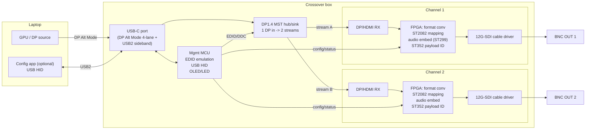

# 02 — System Architecture

## Signal path, end to end

## Block-by-block

### 1. USB-C front end
- USB-C receptacle wired for **DisplayPort Alt Mode**. A USB-C **PD/Alt-Mode
  controller** (CC-line negotiation) requests **4-lane DP** configuration.
- **Why 4-lane:** two independent 4K streams do not fit in 2-lane DP (see
  budget below). 4-lane DP Alt Mode means the SuperSpeed USB pairs are
  repurposed for DP, leaving **USB 2.0** for the management sideband — which is
  all we need for HID config (no high-rate USB data path in v1).
- Sideband: USB 2.0 D+/D- → management MCU as a **USB HID + vendor** device.

### 2. DP MST hub / sink (the "two displays" trick)
- A **DP 1.4 Multi-Stream Transport** hub takes the single DP link and exposes
  **two sink endpoints** to the host. The GPU then drives two logical displays.
- Equivalent commercial topology: the MST-hub chips used in USB-C → dual-HDMI
  docks. Output of the hub is two HDMI 2.0 / DP streams feeding the conversion
  stage.
- Each endpoint owns its **EDID/DDC channel**, which the management MCU
  controls — this is where EDID/frame-rate management lives (see `03`).

### 3. Per-channel conversion (FPGA)
The HDMI/DP-to-SDI conversion is done in an **FPGA** because it needs runtime-
reconfigurable control of timing, payload ID, color, and EDID — fixed-function
bridge silicon can't expose that. Per channel the FPGA:
1. Receives the HDMI 2.0 / DP stream (FPGA transceiver + HDMI/DP RX core).
2. **Maps to SMPTE serial-digital:** ST 2082-10 (12G, 2160p50/59.94/60),
   ST 2081 (6G, 2160p ≤30), ST 425 (3G, 1080p), ST 292 (HD).
3. **Embeds audio** (ST 299 audio data packets) from the DP/HDMI audio stream.
4. Inserts **ST 352 payload identifier** and any ancillary (VPID, RP188 TC if
   sourced).
5. Serializes to the cable driver at the SDI line rate.

A single mid-size FPGA with ≥4 multi-gigabit transceivers handles **both**
channels (2 RX + 2 TX serial links). One FPGA, two pipelines.

### 4. SDI cable drivers
- One **12G-SDI cable driver** per output → 75Ω BNC. Auto rate 12G/6G/3G/HD/SD.
- Optional **reclocker** if jitter budget requires it before the driver.

### 5. Management MCU
- **EDID emulation** for both sink endpoints (writable EDID, profile store).
- **USB HID** endpoint for the config app.
- Drives **status LEDs** and optional **OLED**.
- Configures the FPGA pipelines (output format lock, color range, audio
  routing) over a control bus (SPI/I2C/UART).

## Link-bandwidth budget

**DP 1.4 HBR3, 4 lanes:** 4 × 8.1 Gbit/s = 32.4 Gbit/s raw → ×0.8 (8b/10b) =
**25.92 Gbit/s usable**, shared across both MST streams.

Per-stream active video rate (pixel rate × bits/pixel; blanking adds overhead
but illustrates feasibility):

| Format | Pixel rate | bits/px | Rate/stream | **Two streams** | Fits 4-lane HBR3? |
|---|---|---|---|---|---|
| 1080p59.94 4:2:2 10b | 124 Mpx/s | 20 | 2.49 Gb/s | 4.97 Gb/s | ✅ trivially |
| 2160p30 4:2:2 10b | 249 Mpx/s | 20 | 4.97 Gb/s | 9.95 Gb/s | ✅ easily |
| 2160p59.94 4:2:2 10b | 498 Mpx/s | 20 | 9.95 Gb/s | **19.9 Gb/s** | ✅ with blanking margin |
| 2160p59.94 4:4:4 8b | 498 Mpx/s | 24 | 11.94 Gb/s | 23.9 Gb/s | ⚠️ needs **DSC** or 4:2:2 |

**Headline capability:** two independent outputs up to **2160p59.94 4:2:2
10-bit** — which is exactly the color sampling 12G-SDI carries (ST 2082-10), so
nothing is lost in conversion. Full-4:4:4 dual-4K60 needs DP **DSC** and is a
stretch goal; everything at/below dual-4K60 4:2:2 is the design target.

### Graceful degradation ladder

When the host link can't carry both outputs at full 4K — most commonly because
the host only grants **2-lane** DP Alt Mode (see `06` Q2), or only bus power is
available (below) — the box must **degrade predictably**, never fail to a black
output. The intended ladder, advertised via EDID (`03`) so the host picks a
supported point:

1. **Dual 2160p59.94** (4:2:2 10b) — full capability; needs 4-lane DP + adequate power.
2. **Single 2160p (twin output)** — one 4K stream **mirrored to both BNCs**.
   Preserves a 4K feed when the link/power can't sustain two independent 4K streams.
3. **Dual 1080p59.94** (HD, independent) — two independent outputs, dropped to HD.
4. **Single 1080p (twin output)** — last-resort guaranteed-good state.

The operator can also **pin** a rung via an EDID profile (e.g. force "dual HD"
rather than letting the box auto-negotiate 4K). "Twin output" = the same stream
fanned to both SDI drivers, which is cheap (no second RX/pipeline pressure) and
genuinely useful (feed two monitors off one 4K source). The active rung is shown
on the status LEDs / OLED and reported to the config app.

**SDI side capacities (per output, single-link):**
- 12G (ST 2082-1, 11.88 Gb/s): 2160p 50 / 59.94 / 60.
- 6G (ST 2081): 2160p 23.98 / 24 / 25 / 29.97 / 30.
- 3G (ST 425): 1080p 50 / 59.94 / 60.
- HD (ST 292): 1080i / 720p / 1080p ≤30.

## Power

Dual 12G cable drivers + FPGA + MST hub is a **multi-watt** load (rough order:
FPGA 2–4 W, two 12G drivers ~1 W each, MST hub + housekeeping ~1–2 W →
**~5–8 W total**). A host USB-C port without a PD contract may only offer
~4.5–7.5 W, so **bus power is marginal for dual 4K**. Design decisions:

- Primary: negotiate **USB PD** to pull adequate power from the host where
  available.
- **Secondary USB-C power-in port (decided):** a dedicated second USB-C jack
  that accepts power from **either** another USB-C port (a second laptop port, a
  hub/dock) **or** a standard **USB-C PD wall PSU**. It is a **PD sink only** (no
  data, no Alt Mode on this port) — purely supplemental rail feed. This keeps
  the "one cable when you can" story while giving a clean, ubiquitous power
  option (USB-C PSUs are everywhere; no proprietary barrel brick to lose).
- **Power-source arbitration:** the box prefers the aux port when present and
  falls back to host bus/PD power when it isn't, switching without dropping the
  outputs. If neither source can sustain the requested format, it **degrades**
  down the ladder above rather than browning out (e.g. dual 1080p on bus power,
  dual 4K60 only with aux power).
- Exact wattage thresholds per rung are an **open question** (`06`) pending real
  silicon current draw from the sourcing research.

## Latency

Native DP Alt Mode + line-based SDI mapping is **sub-frame** (no frame buffer in
v1). Active FRC (Tier 2) adds ≥1 frame of buffering by definition — that is the
cost of true rate conversion and is opt-in.
</content>
