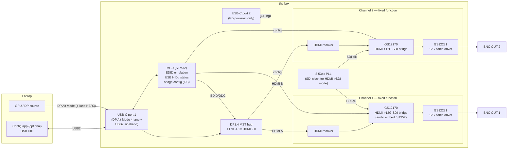

# 02 — System Architecture

> **Baseline = the "dumb" fixed-function design (no FPGA, no SOM, no DDR).** The
> product is an integrated *format converter*: HDMI/DP in → SDI out, ×2, in one
> box — i.e. a USB-C MST dongle + two HDMI→SDI micro-converters collapsed onto one
> board. A heavier **FPGA-based "smart" variant** (active frame-rate conversion,
> color processing, genlock) is documented as a **future Pro option** at the end,
> not v1.

## Signal path, end to end (v1 baseline)

**No FPGA. No DDR. No SOM.** A 4–6 layer board carries it; the only stringent
routing is the **12G-SDI differential pair** and the **HDMI TMDS pairs**
(controlled impedance, length-matched) — *not* a DDR bus, which is exactly the
hard thing that made a SOM worth it on Schindler and which we don't have here.

## Block-by-block

### 1. USB-C front end
- USB-C receptacle wired for **DisplayPort Alt Mode**; a USB-C **PD/Alt-Mode
  controller** (TI TPS65987D class) negotiates **4-lane DP**.
- **Why 4-lane:** two independent 4K streams don't fit in 2-lane DP (budget
  below). 4-lane repurposes the SuperSpeed pairs for DP, leaving **USB 2.0** for
  the management sideband (HID config) — all we need.

### 2. DP MST split (the "two displays" trick — still required)
The one genuinely hard, sourcing-sensitive block — *unchanged by going FPGA-less.*
A **DP 1.4 MST hub** splits the single DP link into **two independent HDMI 2.0
streams**. Options + sourcing in `04` Block 2 / `07`:
- Discrete hub: **Synaptics VMM6210** (integrates USB-C input), **Parade
  PS8650**, **Realtek RTD2186**.
- For prototyping, an **off-the-shelf USB-C→dual-HDMI MST adapter** stands in for
  the hub (see `07`).

Each hub output owns an **EDID/DDC channel** the MCU controls — see §5, this is
where EDID/frame-rate management lives, and it matters even in the dumb design
(below).

> ### ⚠️ HOST PLATFORM SUPPORT — the MST-vs-USB4 fork (defining decision, `06` Q-MAC)
> **macOS does NOT support DP MST extended desktop — it mirrors** (hardware-locked
> on Apple Silicon; verified current 2026, no fix coming). So an **MST** front end
> gives **two independent outputs on Windows/Linux, but only two *identical*
> (mirrored) outputs on Mac.** For a Mac-heavy broadcast/production market that is
> a **dealbreaker** for the "two independent" promise (though dual-mirror is still
> useful = one source → two SDI destinations, our twin-output mode).
>
> Macs deliver independent dual-display via **Thunderbolt/USB4 DP tunneling**, not
> MST. The good news: a **USB4 hub (Realtek RTS5490 — non-Intel, not TB-cert-
> gated, fixed-function, NOT an FPGA)** can replace the MST hub and feed the same
> `→ GS12170 → SDI` chain, giving **independent dual on Mac (M4+/Pro/Max) and
> Windows** while staying "dumb." Caveats: pricier/more complex front end; may
> require a USB4/TB host (could *narrow* cheap-DP-Alt-only-PC support — verify);
> base **M1/M2/M3 Macs cap at one external display** regardless; and **"macOS
> extends across RTS5490's two tunneled streams" is UNVERIFIED — must test on a
> real M4/M5 Mac.**
>
> | Front end | Win/Linux indep. | **Mac indep.** | Cheap DP-Alt PC | FPGA? | Cost |
> |---|---|---|---|---|---|
> | **MST hub** (baseline) | ✅ | ❌ mirror | ✅ | no | low |
> | **USB4 hub (RTS5490)** | ✅ (USB4/TB) | ✅ (M4+/Pro/Max) | ⚠️ verify | no | higher |
>
> **Decision is "who's the customer?":** Windows live-events/AV → MST is fine.
> Mac broadcast/production → must go USB4. Prototype conversion on MST regardless
> (the GS12170 chain is identical); gate the production front-end choice on an
> RTS5490 + real-M4-Mac evaluation.

### 3. Per-channel conversion — **Semtech GS12170 bridge ASIC (no FPGA)**
One fixed-function chip per channel does the whole conversion. The GS12170 is a
**bidirectional** bridge (SDI→HDMI / HDMI→SDI / gearbox); we run it in **HDMI→SDI
mode** — a first-class supported mode, even though the part is often *listed
"SDI→HDMI" first*.
- **HDMI 2.0 in (≤4Kp60 4:2:2 10-bit) → 12G-SDI out.** Auto-spans HD-SDI / 3G /
  6G / 12G (ST 292 → ST 2082-1).
- **Needs an external PLL (Si534x) in HDMI→SDI mode** to generate the SDI output
  clock — a small, cheap clock chip shared across both bridges.
- **Embeds audio** (up to 16 ch @ 48 kHz) and auto-builds the **ST 352 payload
  ID**; carries HDMI InfoFrames incl. HDR metadata.
- 196-ball BGA, 12 × 12 mm, **< 2 W**. ~$73/ea qty 1 (less at volume).
- **Companions (small, cheap):** an **HDMI redriver/retimer** on the cable input
  (the GS12170 HDMI port is chip-to-chip TMDS), and a **GS12281 12G reclocking
  cable driver** on the SDI output to the 75 Ω BNC.
- **HDCP:** the GS12170 expects **unencrypted** TMDS and does no HDCP — which
  *aligns with our non-HDCP-sink posture* (`06` Q11). Ensure the MST hub upstream
  passes unencrypted TMDS (does not authenticate as an HDCP sink).
- ⚠️ **Lifecycle is the top risk** (`06`): one source flags the GS12170 as
  EOL/NRND, yet it's stocked at DigiKey/Mouser/Arrow/LCSC — **confirm with Semtech
  before designing it in.** Fallback if truly EOL = the FPGA recipe (small
  ECP5/Artix + SDI IP + HDMI RX), i.e. the "smart variant" minus the smarts.

### 4. SDI cable driver
- **Semtech GS12281** 12G **reclocking** cable driver per output → 75 Ω BNC. The
  reclocking stage cleans jitter to meet SMPTE ST 2082 over real coax. (In the
  dumb design the SDI bit-clock is **derived from the incoming HDMI pixel clock**
  — output is genlocked to the source, not house sync; fine for passthrough.)

### 5. Management MCU (EDID is still the value-add)
A small **STM32** (no FPGA needed):
- **EDID emulation** on both MST-hub DDC channels (writable, profile store).
- **USB HID** endpoint for the optional config app; **status LEDs / OLED**.
- **Bridge + hub config** over I²C.

**Why EDID still matters in the dumb design:** the GS12170 only accepts a **valid
SMPTE raster** (e.g. exactly 1080p/2160p at SMPTE rates incl. /1.001 fractional
rates) — arbitrary VESA/PC timings won't map to a legal SDI format. So the
EDID-driven **resolution / frame-rate management** the product was always meant
to have (`03`) isn't a luxury here — it's how we **force the laptop to emit
SDI-legal timings** so the bridge produces clean output. This is *passive*
(EDID-nudged, source-locked) management; **active** rate conversion (60.00→59.94)
is the FPGA-only Pro feature.

## Link-bandwidth budget (DP/host side — unchanged)

**DP 1.4 HBR3, 4 lanes:** 4 × 8.1 Gbit/s = 32.4 raw → ×0.8 = **25.92 Gbit/s
usable**, shared across both MST streams.

| Format | Rate/stream | **Two streams** | Fits 4-lane HBR3? |
|---|---|---|---|
| 1080p59.94 4:2:2 10b | 2.49 Gb/s | 4.97 Gb/s | ✅ trivially |
| 2160p30 4:2:2 10b | 4.97 Gb/s | 9.95 Gb/s | ✅ easily |
| 2160p59.94 4:2:2 10b | 9.95 Gb/s | **19.9 Gb/s** | ✅ with blanking margin |
| 2160p59.94 4:4:4 8b | 11.94 Gb/s | 23.9 Gb/s | ⚠️ needs DSC or 4:2:2 |

**Headline:** two independent outputs up to **2160p59.94 4:2:2 10-bit** — exactly
what 12G-SDI carries (ST 2082-10), and what the GS12170 accepts on its HDMI side.

### Graceful degradation ladder (host/link-driven, via EDID)
1. **Dual 2160p59.94** — full capability (needs 4-lane DP + adequate power).
2. **Single 2160p, mirrored to both BNCs** — preserves a 4K feed when the
   link/power can't sustain two independent 4K streams.
3. **Dual 1080p59.94** (independent HD).
4. **Single 1080p, mirrored** — last-resort guaranteed-good state.

Advertised via EDID so the host picks a supported rung; operator can pin one.

**SDI capacities (per output, single-link, auto in GS12170):** 12G (2160p
50/59.94/60) · 6G (2160p ≤30) · 3G (1080p 50/59.94/60) · HD (1080i/720p).

## Power (lower than the FPGA design)
Per channel ≈ GS12170 (<2 W) + GS12281 (~0.3 W) + redriver (~0.2 W). Two channels
+ MST hub + PD/MCU ≈ **~5–7 W** worst-case dual-4K (no FPGA load). Still likely
above bare bus power, so:
- Negotiate **USB PD** from the host where available.
- **Secondary USB-C power-in port** (PD sink only, no data) accepting **another
  USB-C port or a standard USB-C PD PSU**; prefer host PD, fall back to aux,
  **degrade** rather than brown out. Per-rung wattage TBD (`06` Q3).

## Clocking — source-locked, NO frame repeat/drop (important)
The dumb design is **genlocked to the source**: the external PLL (Si534x) takes
the **recovered HDMI clock as its reference and locks to it**, then outputs a
clean, low-jitter SDI clock *at the same locked frequency*. It is **not** a free-
running oscillator — so input and output rates are identical and **no frame is
ever doubled or dropped.**

Why a PLL is still needed even though the source provides the timing:
1. **Jitter attenuation** — the HDMI-recovered clock is far too jittery to meet
   SDI's SMPTE ST 2082 jitter spec; the Si534x cleans it (locked to source).
2. **Frequency synthesis** — derives the exact SDI bit-clock rates from that
   reference.

**Structural guarantee:** the GS12170 has **no frame buffer** (no DRAM; a <2 W
line-based bridge), so frame doubling/dropping is *physically impossible* — pure
passthrough is baked in, not a setting. The only buffering is a small line/FIFO
for phase alignment, which never over/underflows because the output is locked to
the source. **Consequence:** output frame-rate accuracy is *inherited from the
laptop* — which is exactly why EDID management (`03`) matters: it makes the laptop
emit the broadcast-legal rate, and the converter passes it cadence-for-cadence.

Frame repeat/drop only exists in the **Pro/FPGA variant**, which deliberately adds
a DDR frame buffer + an **asynchronous** output clock to do true frame-rate
conversion (60.00→59.94, 50↔60). That is the opt-in opposite of this design.

## Latency
Fixed-function line-based conversion is **sub-frame**, source-locked. (Active FRC
— the Pro variant — adds ≥1 frame of buffering by definition; opt-in only.)

## Future "smart" / Pro variant (NOT v1)
Swap the two GS12170 bridges for a single **FPGA** (+ DDR) to add: **active
frame-rate conversion** (host 60.00 → SDI 59.94, 50↔60), **color/range
processing**, and **genlock to house reference**. This is the only thing that
justifies an FPGA + DDR here, and it mirrors Schindler's Mini/Pro split: same
front end (USB-C + MST hub + MCU), different conversion core. The v1 PCB can
leave the door open but should not stuff it.
</content>
